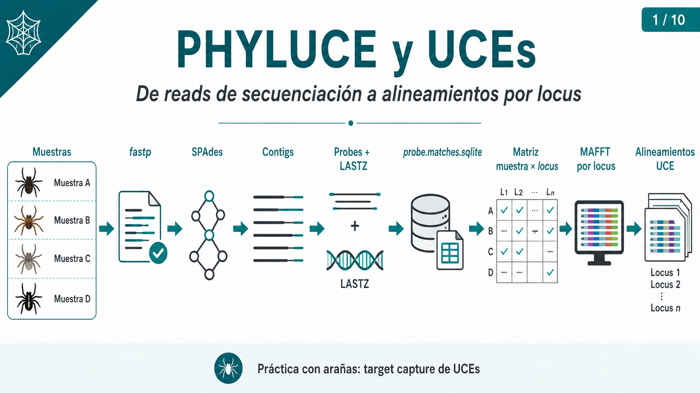
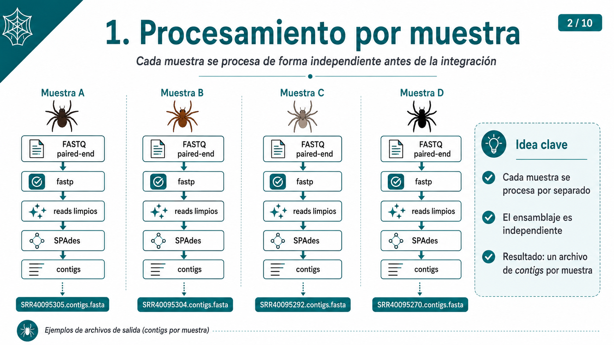
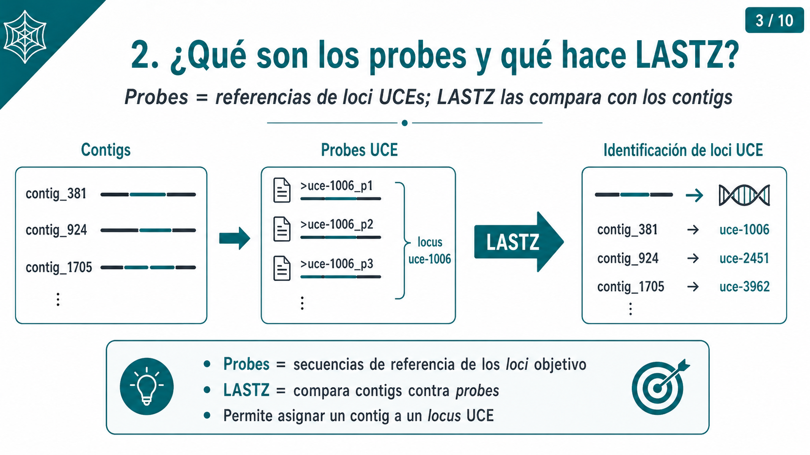
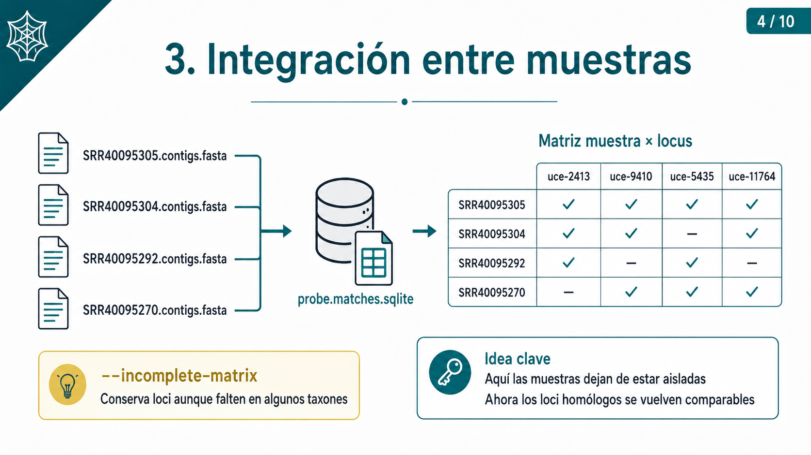
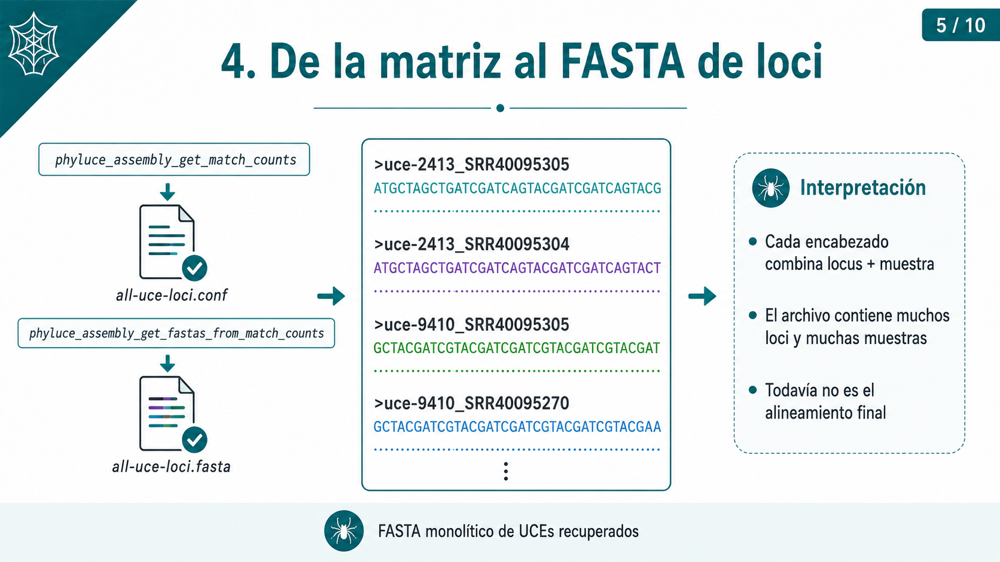
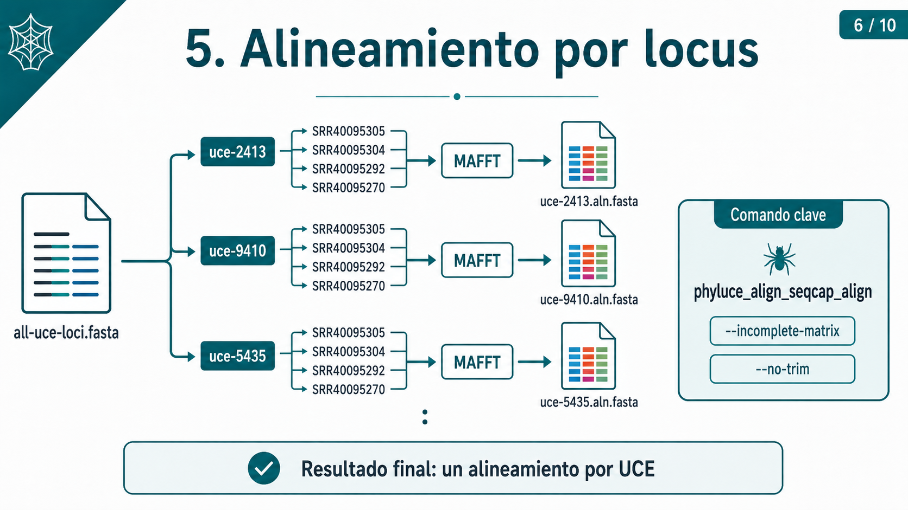
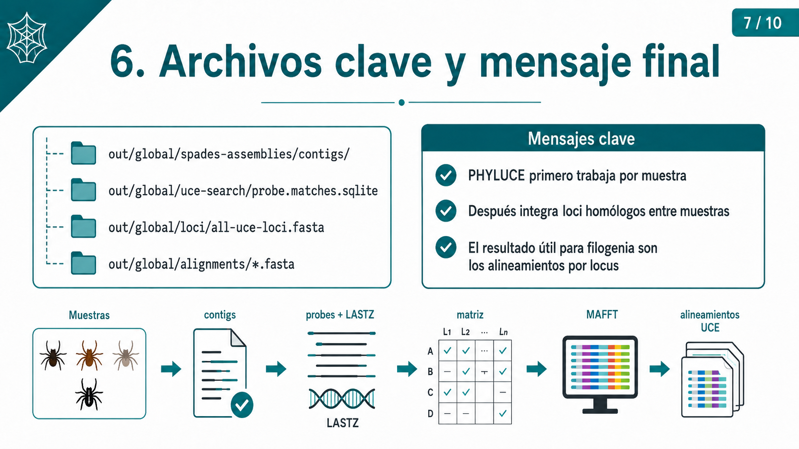

# Práctica: procesamiento de UCEs con PHYLUCE

## Objetivo

Esta práctica tiene dos partes claramente separadas.

### Parte I. Procesamiento de una muestra

Primero procesaremos **una sola muestra paso a paso** para comprender qué hace cada programa y qué archivos produce PHYLUCE.

Seguiremos:

```text
FASTQ
  │
  ▼
fastp
  │
  ▼
reads limpios
  │
  ▼
SPAdes
  │
  ▼
contigs
  │
  ▼
probes + LASTZ
  │
  ▼
UCEs identificados
  │
  ▼
secuencias UCE de una muestra
```

### Parte II. Pipeline global

Una vez entendido el procedimiento, ejecutaremos un análisis automatizado con **todas las muestras**.

El pipeline global leerá:

```text
metadata/config.sh
metadata/samples.txt
```

y ejecutará:

```text
limpieza
   │
   ▼
ensamblaje por muestra
   │
   ▼
contigs de todas las muestras
   │
   ▼
búsqueda de UCEs
   │
   ▼
matriz muestra × locus
   │
   ▼
extracción de secuencias
   │
   ▼
alineamiento por locus
```

---

# Datos utilizados

Trabajaremos con cuatro corridas del proyecto:

**Ultraconserved element phylogenomics reveals novel insights into the historical biogeography of euophryine jumping spiders (Araneae: Salticidae)**

- **BioProject:** `PRJNA1506394`
- **SRA Study:** `SRP725708`

| SRA Run | SRA Experiment |
|---|---|
| `SRR40095305` | `SRX34736494` |
| `SRR40095304` | `SRX34736495` |
| `SRR40095292` | `SRX34736507` |
| `SRR40095270` | `SRX34736529` |

Características generales:

```text
Strategy:   Targeted-Capture
Source:     GENOMIC
Selection:  Hybrid Selection
Layout:     PAIRED
Platform:   ILLUMINA
Instrument: Illumina NovaSeq 6000
```

---

# Datos preparados para la clase

Los FASTQ originales contienen varios millones de reads.

Para reducir el tiempo de cómputo se preparó previamente un subconjunto de:

```text
500,000 reads R1
500,000 reads R2
```

por muestra.

Los archivos están disponibles en:

```text
/srv/bishop/phylogenomics/data/class-fastq/
```

Contenido:

```text
SRR40095270_1.fastq.gz
SRR40095270_2.fastq.gz
SRR40095292_1.fastq.gz
SRR40095292_2.fastq.gz
SRR40095304_1.fastq.gz
SRR40095304_2.fastq.gz
SRR40095305_1.fastq.gz
SRR40095305_2.fastq.gz
```

> El subsampling se utiliza aquí con fines docentes. En un análisis de investigación debe evaluarse si reducir la cobertura es apropiado, ya que puede disminuir el número de loci recuperados.

---

# PARTE I. Procesamiento paso a paso de una muestra

Esta primera parte se realiza con **una sola muestra** para observar claramente qué ocurre en cada etapa.

---

# 1. Clonar el repositorio de la práctica

Clonaremos el repositorio que contiene los archivos necesarios para la práctica:

```bash
git clone git@github.com:cristoichkov/clase_phyluce-.git
```

Entramos al directorio del proyecto:

```bash
cd clase_phyluce-
```

Revisamos su contenido:

```bash
ls
```

El repositorio contiene los archivos de configuración, los scripts y la documentación de la práctica.

Durante el análisis se utilizarán además los directorios:

```text
data/
out/
logs/
```

Si todavía no existen, pueden crearse con:

```bash
mkdir -p data/{raw-fastq,clean-fastq,probes} out logs
```

---

# 2. Definir las rutas de los contenedores

Los contenedores están disponibles en:

```text
/srv/bishop/phylogenomics/contenedores/
```

Definimos:

```bash
FASTP_CONTAINER="/srv/bishop/phylogenomics/contenedores/fastp_1.3.6.sif"

PHYLUCE_CONTAINER="/srv/bishop/phylogenomics/contenedores/phyluce_1.6.8.sif"
```

Comprobamos:

```bash
ls -lh ${FASTP_CONTAINER}
```

```bash
ls -lh ${PHYLUCE_CONTAINER}
```

---

# 3. Seleccionar una muestra

Por ejemplo:

```bash
ID=SRR40095305
```

También puede utilizarse cualquiera de:

```text
SRR40095304
SRR40095292
SRR40095270
```

Comprobamos:

```bash
echo ${ID}
```

> Si se abre una nueva terminal será necesario volver a definir la variable `ID`.

---

# 4. Copiar los FASTQ

```bash
cp \
/srv/bishop/phylogenomics/data/class-fastq/${ID}_1.fastq.gz \
/srv/bishop/phylogenomics/data/class-fastq/${ID}_2.fastq.gz \
data/raw-fastq/
```

Comprobamos:

```bash
ls -lh data/raw-fastq/
```

Debemos tener:

```text
${ID}_1.fastq.gz
${ID}_2.fastq.gz
```

---

# 5. Revisar los FASTQ

Podemos observar las primeras secuencias:

```bash
zcat data/raw-fastq/${ID}_1.fastq.gz | head
```

Cada registro FASTQ contiene cuatro líneas:

```text
@identificador
SECUENCIA
+
CALIDAD
```

Contamos los reads:

```bash
zcat data/raw-fastq/${ID}_1.fastq.gz | \
awk 'END {print NR/4}'
```

```bash
zcat data/raw-fastq/${ID}_2.fastq.gz | \
awk 'END {print NR/4}'
```

Esperamos:

```text
500000
```

en ambos archivos.

---

# 6. Limpieza con fastp

Conceptualmente:

```text
FASTQ
  │
  ▼
fastp
  │
  ▼
reads limpios
```

Creamos:

```bash
mkdir -p out/fastp-report
```

Creamos el script:

```bash
nano bin/fastp.slurm
```

Contenido:

```bash
#!/bin/bash

#SBATCH --job-name=fastp
#SBATCH --partition=ripley
#SBATCH --cpus-per-task=2
#SBATCH --mem=4G
#SBATCH --time=00:20:00
#SBATCH --output=logs/%x-%j.out
#SBATCH --error=logs/%x-%j.err

set -euo pipefail

cd "${SLURM_SUBMIT_DIR}"

ID=$1

FASTP_CONTAINER="/srv/bishop/phylogenomics/contenedores/fastp_1.3.6.sif"

INPUT="data/raw-fastq"
OUTDIR="data/clean-fastq/${ID}"
REPORT="out/fastp-report"

mkdir -p "${OUTDIR}" "${REPORT}"

apptainer exec ${FASTP_CONTAINER} \
    fastp \
    -i ${INPUT}/${ID}_1.fastq.gz \
    -I ${INPUT}/${ID}_2.fastq.gz \
    -o ${OUTDIR}/${ID}-READ1.fastq.gz \
    -O ${OUTDIR}/${ID}-READ2.fastq.gz \
    --html=${REPORT}/${ID}-fastp.html \
    --json=${REPORT}/${ID}-fastp.json \
    --qualified_quality_phred=20 \
    --detect_adapter_for_pe \
    --thread=${SLURM_CPUS_PER_TASK}
```

Ejecutamos:

```bash
sbatch bin/fastp.slurm ${ID}
```

Revisamos:

```bash
squeue -u $USER
```

Cuando termine:

```bash
ls -lh data/clean-fastq/${ID}/
```

Esperamos:

```text
${ID}-READ1.fastq.gz
${ID}-READ2.fastq.gz
```

---

# 7. ¿Por qué READ1 y READ2?

Los archivos originales tienen:

```text
${ID}_1.fastq.gz
${ID}_2.fastq.gz
```

Después de `fastp` los nombramos:

```text
${ID}-READ1.fastq.gz
${ID}-READ2.fastq.gz
```

Esto facilita que el wrapper de PHYLUCE reconozca los mates.

---

# 8. Crear `assembly.conf`

PHYLUCE necesita conocer:

1. el nombre de la muestra;
2. el directorio donde están los reads limpios.

Creamos:

```bash
printf "[samples]\n%s:%s/data/clean-fastq/%s\n" \
    "${ID}" "$(pwd)" "${ID}" \
    > metadata/assembly.conf
```

Revisamos:

```bash
cat metadata/assembly.conf
```

Ejemplo:

```ini
[samples]
SRR40095305:/srv/bishop/phylogenomics/phylogen20/phyluce_uce/data/clean-fastq/SRR40095305
```

---

# 9. Configurar SPAdes

PHYLUCE 1.6.8 utiliza:

```text
~/.phyluce.conf
```

Para los datos de clase utilizamos:

```ini
[spades]
max_memory:8
```

Si el archivo no existe:

```bash
cat > ~/.phyluce.conf <<'EOF'
[spades]
max_memory:8
EOF
```

Comprobamos:

```bash
cat ~/.phyluce.conf
```

---

# 10. Ensamblar con SPAdes

PHYLUCE utiliza:

```text
phyluce_assembly_assemblo_spades
```

para ejecutar SPAdes.

Conceptualmente:

```text
reads cortos
     │
     ▼
   SPAdes
     │
     ▼
   contigs
```

Creamos:

```bash
nano bin/spades.slurm
```

Contenido:

```bash
#!/bin/bash

#SBATCH --job-name=phyluce_spades
#SBATCH --partition=ripley
#SBATCH --cpus-per-task=4
#SBATCH --mem=10G
#SBATCH --time=00:30:00
#SBATCH --output=logs/%x-%j.out
#SBATCH --error=logs/%x-%j.err

set -euo pipefail

cd "${SLURM_SUBMIT_DIR}"

PHYLUCE_CONTAINER="/srv/bishop/phylogenomics/contenedores/phyluce_1.6.8.sif"

apptainer exec ${PHYLUCE_CONTAINER} \
    phyluce_assembly_assemblo_spades \
    --config metadata/assembly.conf \
    --output out/spades-assemblies \
    --cores ${SLURM_CPUS_PER_TASK} \
    --log-path logs
```

Ejecutamos:

```bash
sbatch bin/spades.slurm
```

---

# 11. Revisar los contigs

Cuando termine:

```bash
ls -lh out/spades-assemblies/contigs/
```

PHYLUCE crea:

```text
${ID}.contigs.fasta
```

Comprobamos que el ensamblaje sea válido:

```bash
test -s out/spades-assemblies/${ID}_spades/contigs.fasta \
    && echo "Ensamblaje correcto" \
    || echo "ERROR: SPAdes no produjo contigs.fasta"
```

Definimos:

```bash
CONTIGS="out/spades-assemblies/contigs/${ID}.contigs.fasta"
```

Contamos:

```bash
grep -c "^>" ${CONTIGS}
```

Cada `>` corresponde a un contig.

---

# 12. Preparar los probes

Utilizaremos:

```text
/srv/bishop/phylogenomics/data/spiders/RTA-v3-probe-combine-spider-color-DUPE-SCREENED.fasta
```

Los copiamos al proyecto:

```bash
cp \
/srv/bishop/phylogenomics/data/spiders/RTA-v3-probe-combine-spider-color-DUPE-SCREENED.fasta \
data/probes/RTA-v3-probes.fasta
```

> Se utiliza `cp` y no un enlace simbólico porque durante las pruebas el symlink era visible desde el host pero no podía resolverse correctamente dentro del contenedor Apptainer.

Comprobamos desde el host:

```bash
ls -lh data/probes/RTA-v3-probes.fasta
```

Y desde Apptainer:

```bash
apptainer exec ${PHYLUCE_CONTAINER} \
    ls -lh data/probes/RTA-v3-probes.fasta
```

---

# 13. Revisar los encabezados de los probes

```bash
grep "^>" data/probes/RTA-v3-probes.fasta | head
```

Ejemplo:

```text
>uce-1006_p1 |design:RTA-v1,...
>uce-1006_p2 |design:RTA-v1,...
>uce-1006_p3 |design:RTA-v1,...
```

PHYLUCE utiliza por defecto:

```text
^(uce-\d+)(?:_p\d+.*)
```

Por ejemplo:

```text
uce-1006_p1
uce-1006_p2
uce-1006_p3
      │
      ▼
   uce-1006
```

Varios probes corresponden al mismo locus UCE.

---

# 14. Comparar contigs contra probes

PHYLUCE utiliza:

```text
phyluce_assembly_match_contigs_to_probes
```

y realiza la comparación mediante LASTZ.

Creamos:

```bash
nano bin/uce_search.slurm
```

Contenido:

```bash
#!/bin/bash

#SBATCH --job-name=uce_search
#SBATCH --partition=ripley
#SBATCH --cpus-per-task=1
#SBATCH --mem=4G
#SBATCH --time=01:00:00
#SBATCH --output=logs/%x-%j.out
#SBATCH --error=logs/%x-%j.err

set -euo pipefail

cd "${SLURM_SUBMIT_DIR}"

PHYLUCE_CONTAINER="/srv/bishop/phylogenomics/contenedores/phyluce_1.6.8.sif"

PROBES="data/probes/RTA-v3-probes.fasta"

apptainer exec ${PHYLUCE_CONTAINER} \
    phyluce_assembly_match_contigs_to_probes \
    --contigs out/spades-assemblies/contigs \
    --probes ${PROBES} \
    --output out/uce-search \
    --log-path logs
```

Si existe una ejecución anterior:

```bash
rm -rf out/uce-search
```

Ejecutamos:

```bash
sbatch bin/uce_search.slurm
```

---

# 15. Revisar los matches

```bash
ls -lh out/uce-search/
```

Encontraremos:

```text
probe.matches.sqlite
${ID}.contigs.lastz
```

Podemos revisar:

```bash
grep -Ri "unique\|match" logs/ | tail -n 20
```

Para `SRR40095305` se obtuvo:

```text
SRR40095305: 3145 (11.33%) uniques of 27752 contigs,
0 dupe probe matches,
55 UCE loci removed for matching multiple contigs,
53 contigs removed for matching multiple UCE loci
```

Interpretación:

```text
27752 contigs
      │
      ▼
comparación contra probes
      │
      ▼
3145 asociaciones UCE no ambiguas
```

---

# 16. Extraer los UCEs de una muestra

Creamos:

```bash
printf "[all]\n%s\n" "${ID}" \
    > metadata/taxon-set.conf
```

Revisamos:

```bash
cat metadata/taxon-set.conf
```

Creamos:

```bash
mkdir -p out/loci
```

Obtenemos los loci:

```bash
apptainer exec ${PHYLUCE_CONTAINER} \
    phyluce_assembly_get_match_counts \
    --locus-db out/uce-search/probe.matches.sqlite \
    --taxon-list-config metadata/taxon-set.conf \
    --taxon-group all \
    --output out/loci/${ID}-uce-loci.conf
```

Extraemos las secuencias:

```bash
apptainer exec ${PHYLUCE_CONTAINER} \
    phyluce_assembly_get_fastas_from_match_counts \
    --contigs out/spades-assemblies/contigs \
    --locus-db out/uce-search/probe.matches.sqlite \
    --match-count-output out/loci/${ID}-uce-loci.conf \
    --output out/loci/${ID}-uce-loci.fasta
```

Contamos:

```bash
grep -c "^>" out/loci/${ID}-uce-loci.fasta
```

Para `SRR40095305` obtuvimos:

```text
3145
```

---

# 17. ¿Qué representa cada secuencia?

```bash
grep "^>" out/loci/${ID}-uce-loci.fasta | head
```

Ejemplo:

```text
>uce-2413_SRR40095305 |uce-2413
>uce-9410_SRR40095305 |uce-9410
>uce-20003818_SRR40095305 |uce-20003818
```

Cada registro corresponde a un **locus UCE diferente** recuperado para esa muestra.

Por ejemplo:

```text
uce-2413
   │
   └── secuencia recuperada de SRR40095305
```

Una secuencia puede incluir tanto el núcleo ultraconservado como regiones flanqueantes más variables.

---

# PARTE II. Pipeline global con todas las muestras

Ya conocemos qué ocurre con una muestra.

Ahora procesaremos automáticamente:

```text
SRR40095305
SRR40095304
SRR40095292
SRR40095270
```

La lógica será:

```text
cada muestra
FASTQ
  │
  ▼
fastp
  │
  ▼
SPAdes
  │
  ▼
contigs
  │
  ├───────────────┐
  │               │
  ▼               ▼
contigs muestra 1
contigs muestra 2
contigs muestra 3
contigs muestra 4
        │
        ▼
PHYLUCE + probes
        │
        ▼
probe.matches.sqlite
        │
        ▼
matriz muestra × locus
        │
        ▼
secuencias UCE
        │
        ▼
alineamiento por locus
```



---

# 18. Crear el proyecto global

```bash
mkdir -p phyluce_global/{bin,metadata,data/clean-fastq,data/probes,out,logs}

cd phyluce_global
```

La estructura será:

```text
phyluce_global/
├── README.md
├── bin/
│   ├── 01_clean_reads.slurm
│   └── 02_phyluce_all.slurm
├── metadata/
│   ├── config.sh
│   └── samples.txt
├── data/
│   ├── clean-fastq/
│   └── probes/
├── out/
└── logs/
```

---

# 19. Archivo de configuración

Todo el pipeline global lee:

```text
metadata/config.sh
```

Aquí concentramos las rutas y parámetros.

Ejemplo:

```bash
SAMPLE_LIST="metadata/samples.txt"

RAW_SOURCE_DIR="/srv/bishop/phylogenomics/data/class-fastq"

CONTAINER_DIR="/srv/bishop/phylogenomics/contenedores"

FASTP_CONTAINER="${CONTAINER_DIR}/fastp_1.3.6.sif"

PHYLUCE_CONTAINER="${CONTAINER_DIR}/phyluce_1.6.8.sif"

PROBES_SOURCE="/srv/bishop/phylogenomics/data/spiders/RTA-v3-probe-combine-spider-color-DUPE-SCREENED.fasta"

CLEAN_DIR="data/clean-fastq"

PROBES_DIR="data/probes"

FASTP_REPORT_DIR="out/fastp-report"

GLOBAL_DIR="out/global"

LOG_DIR="logs"

FASTP_Q=20

SPADES_MAX_MEMORY=8
```

Así no es necesario modificar los scripts cuando cambian las rutas.

---

# 20. Lista de muestras

El archivo:

```text
metadata/samples.txt
```

contiene:

```text
SRR40095305
SRR40095304
SRR40095292
SRR40095270
```

Cada identificador debe corresponder a:

```text
ID_1.fastq.gz
ID_2.fastq.gz
```

en:

```text
RAW_SOURCE_DIR
```

Para otro proyecto basta con sustituir esta lista.



---

# 21. Script global de limpieza

El primer script es:

```text
bin/01_clean_reads.slurm
```

Ejecutamos:

```bash
sbatch bin/01_clean_reads.slurm
```

El script:

```text
config.sh
   +
samples.txt
   │
   ▼
lee muestra 1
lee muestra 2
lee muestra 3
lee muestra 4
   │
   ▼
fastp
   │
   ▼
data/clean-fastq/
```

Las salidas tendrán:

```text
data/clean-fastq/SRR40095305/
├── SRR40095305-READ1.fastq.gz
└── SRR40095305-READ2.fastq.gz
```

y lo mismo para las demás muestras.

Los reportes quedan en:

```text
out/fastp-report/
```

Podemos monitorear:

```bash
squeue -u $USER
```

---

# 22. Script global de PHYLUCE

Cuando la limpieza termine:

```bash
sbatch bin/02_phyluce_all.slurm
```

Este script comienza con los reads limpios y ejecuta:

```text
1. crear assembly-all.conf
2. ensamblar cada muestra con SPAdes
3. reunir los contigs
4. copiar los probes
5. comparar contigs contra probes
6. crear probe.matches.sqlite
7. crear taxon-set-all.conf
8. obtener matriz muestra × locus
9. extraer las secuencias UCE
10. alinear cada locus con MAFFT
```

---

# 23. `assembly-all.conf`

Se genera automáticamente:

```text
metadata/assembly-all.conf
```

Ejemplo:

```ini
[samples]
SRR40095305:/ruta/proyecto/data/clean-fastq/SRR40095305
SRR40095304:/ruta/proyecto/data/clean-fastq/SRR40095304
SRR40095292:/ruta/proyecto/data/clean-fastq/SRR40095292
SRR40095270:/ruta/proyecto/data/clean-fastq/SRR40095270
```

Cada muestra se ensambla de forma independiente.

---

# 24. Contigs de todas las muestras

Después de SPAdes:

```text
out/global/spades-assemblies/contigs/
├── SRR40095305.contigs.fasta
├── SRR40095304.contigs.fasta
├── SRR40095292.contigs.fasta
└── SRR40095270.contigs.fasta
```

Aquí comienza la integración filogenómica.

---

# 25. Buscar UCEs en todas las muestras

PHYLUCE ejecuta:

```text
phyluce_assembly_match_contigs_to_probes
```

sobre todo el directorio de contigs.

El resultado principal es:

```text
out/global/uce-search/probe.matches.sqlite
```

La base contiene:

```text
muestra
  │
  ▼
contig
  │
  ▼
locus UCE
```



---

# 26. Crear el conjunto de taxones

El script genera:

```text
metadata/taxon-set-all.conf
```

Con:

```ini
[all]
SRR40095305
SRR40095304
SRR40095292
SRR40095270
```

---

# 27. Matriz muestra × locus

El script utiliza:

```text
phyluce_assembly_get_match_counts
```

con:

```text
--incomplete-matrix
```

Esto permite conservar loci aunque no estén presentes en todas las muestras.

Conceptualmente:

```text
                uce-1   uce-2   uce-3

SRR40095305       ✓       ✓       ✓
SRR40095304       ✓       -       ✓
SRR40095292       ✓       ✓       ✓
SRR40095270       -       ✓       ✓
```

El resultado queda en:

```text
out/global/loci/all-uce-loci.conf
```



---

# 28. Extraer todas las secuencias

PHYLUCE genera:

```text
out/global/loci/all-uce-loci.fasta
```

Este archivo contiene muchas muestras y muchos loci.

Ejemplo:

```text
>uce-2413_SRR40095305
SECUENCIA...

>uce-2413_SRR40095304
SECUENCIA...

>uce-9410_SRR40095305
SECUENCIA...

>uce-9410_SRR40095270
SECUENCIA...
```

Todavía no es un alineamiento único.



---

# 29. Separar y alinear por locus

El script utiliza:

```text
phyluce_align_seqcap_align
```

con MAFFT.

Conceptualmente:

```text
all-uce-loci.fasta
       │
       ├── uce-2413
       │      ├── SRR40095305
       │      ├── SRR40095304
       │      ├── SRR40095292
       │      └── SRR40095270
       │               │
       │               ▼
       │             MAFFT
       │               │
       │               ▼
       │      alineamiento uce-2413
       │
       ├── uce-9410
       │      ├── SRR40095305
       │      ├── SRR40095304
       │      └── SRR40095270
       │               │
       │               ▼
       │             MAFFT
       │
       └── ...
```

Usamos:

```text
--incomplete-matrix
```

porque algunos loci pueden faltar en algunas muestras.

También utilizamos:

```text
--no-trim
```

conserva el alineamiento generado por MAFFT sin eliminar posiciones




---

# 30. Resultados finales

La salida tendrá una estructura semejante a:

```text
out/global/
├── spades-assemblies/
│   └── contigs/
│       ├── SRR40095305.contigs.fasta
│       ├── SRR40095304.contigs.fasta
│       ├── SRR40095292.contigs.fasta
│       └── SRR40095270.contigs.fasta
│
├── uce-search/
│   ├── probe.matches.sqlite
│   └── *.lastz
│
├── loci/
│   ├── all-uce-loci.conf
│   ├── all-uce-loci.incomplete
│   └── all-uce-loci.fasta
│
└── alignments/
    ├── *.fasta
    ├── *.fasta
    └── ...
```

Cada FASTA de `alignments/` representa **un locus UCE alineado**.



---

# 31. Revisar los alineamientos

Contamos:

```bash
find out/global/alignments \
    -type f -name "*.fasta" | wc -l
```

Revisamos algunos:

```bash
find out/global/alignments \
    -type f -name "*.fasta" | head
```

Cada archivo puede contener:

```text
UCE-X
├── SRR40095305
├── SRR40095304
├── SRR40095292
└── SRR40095270
```

si ese locus fue recuperado para las cuatro muestras.

---

# 32. Utilizar el pipeline con muestras propias

Para otro proyecto normalmente solo necesitamos modificar dos archivos.

## `metadata/config.sh`

Cambiar:

```bash
RAW_SOURCE_DIR="/ruta/a/mis_fastq"

FASTP_CONTAINER="/ruta/fastp.sif"

PHYLUCE_CONTAINER="/ruta/phyluce.sif"

PROBES_SOURCE="/ruta/probes.fasta"
```

## `metadata/samples.txt`

Por ejemplo:

```text
taxon01
taxon02
taxon03
taxon04
taxon05
```

Los FASTQ deberán llamarse:

```text
taxon01_1.fastq.gz
taxon01_2.fastq.gz
taxon02_1.fastq.gz
taxon02_2.fastq.gz
...
```

Después:

```bash
sbatch bin/01_clean_reads.slurm
```

y cuando termine:

```bash
sbatch bin/02_phyluce_all.slurm
```

---

# 33. Recursos de Slurm

Las rutas generales están en:

```text
metadata/config.sh
```

Pero las directivas:

```bash
#SBATCH --partition
#SBATCH --cpus-per-task
#SBATCH --mem
#SBATCH --time
```

permanecen dentro de los scripts porque Slurm las interpreta antes de que Bash ejecute:

```bash
source metadata/config.sh
```

Si se desea cambiar recursos sin editar el script:

```bash
sbatch \
    --cpus-per-task=8 \
    --mem=16G \
    bin/02_phyluce_all.slurm
```

---

# Resumen final

## Parte I

```text
UNA MUESTRA

FASTQ
  │
  ▼
fastp
  │
  ▼
reads limpios
  │
  ▼
SPAdes
  │
  ▼
contigs
  │
  ▼
probes + LASTZ
  │
  ▼
UCEs
```

## Parte II

```text
TODAS LAS MUESTRAS

config.sh
   +
samples.txt
   │
   ▼
01_clean_reads.slurm
   │
   ▼
reads limpios
   │
   ▼
02_phyluce_all.slurm
   │
   ├── SPAdes por muestra
   ├── contigs
   ├── probes + LASTZ
   ├── probe.matches.sqlite
   ├── matriz muestra × locus
   ├── extracción de UCEs
   └── MAFFT por locus
   │
   ▼
alineamientos UCE
```

---

# Referencia

PHYLUCE 1.6.8:

https://phyluce.readthedocs.io/en/v1.6.8/
